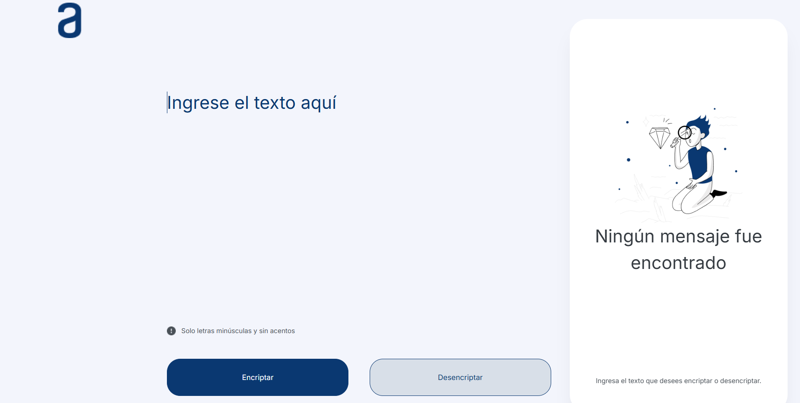

# **Encriptador de Texto - Alura Challenges ONE**


## **Descripción del Proyecto**
Este proyecto es un encriptador de texto interactivo desarrollado como parte del **Alura Challenges ONE**. Permite encriptar y desencriptar mensajes utilizando un conjunto predefinido de reglas, asegurando que los textos intercambiados sean seguros y legibles solo para quienes conozcan el método de codificación.

### **Reglas de Encriptación:**
- La letra "e" se convierte en "enter".
- La letra "i" se convierte en "imes".
- La letra "a" se convierte en "ai".
- La letra "o" se convierte en "ober".
- La letra "u" se convierte en "ufat".

El proyecto cuenta con una interfaz amigable y funcional, diseñada para uso intuitivo.

---

## **Características**

### **Funcionalidades Principales**
1. **Encriptar Texto**:
   - Permite transformar texto plano en su versión encriptada según las reglas establecidas.
2. **Desencriptar Texto**:
   - Convierte un mensaje encriptado de vuelta a su forma original.
3. **Copiar Texto**:
   - Copia el texto resultante al portapapeles con un solo clic.

---

## **Vista Previa**


---

## **Instrucciones de Instalación**

### **Requisitos Previos**
- Navegador web moderno (Google Chrome, Mozilla Firefox, etc.).

### **Pasos para Ejecutar Localmente**
1. Clona este repositorio:
   ```bash
   git clone https://github.com/usuario/encriptador-de-texto.git
